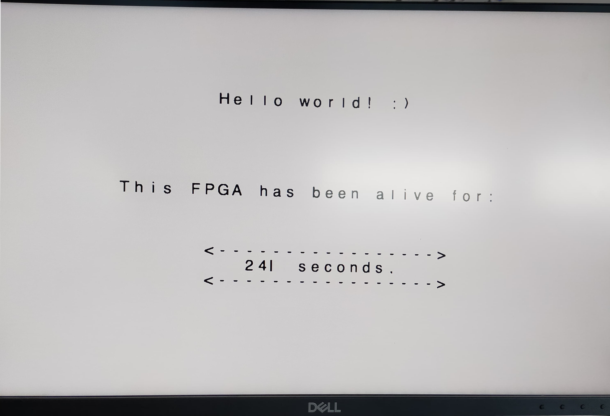
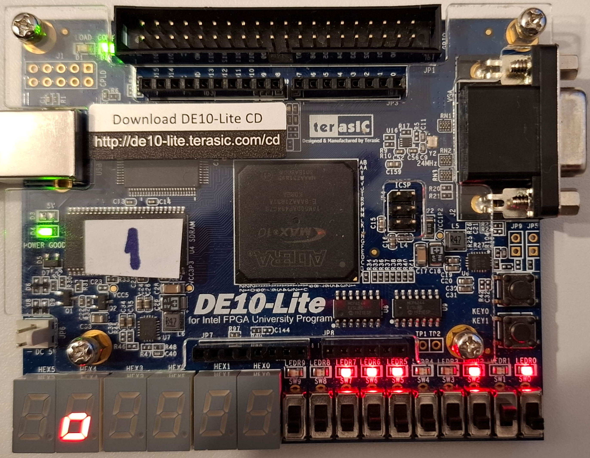
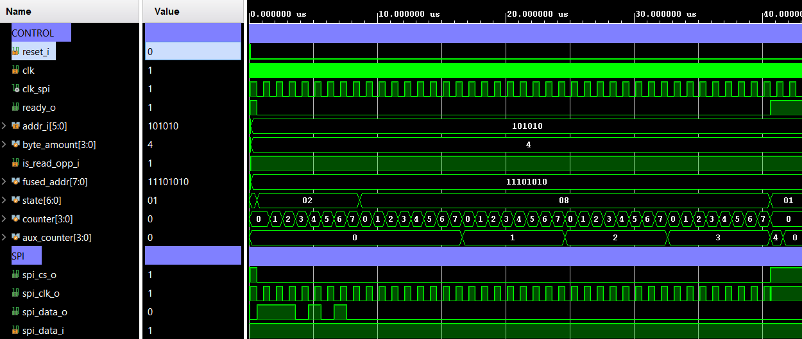
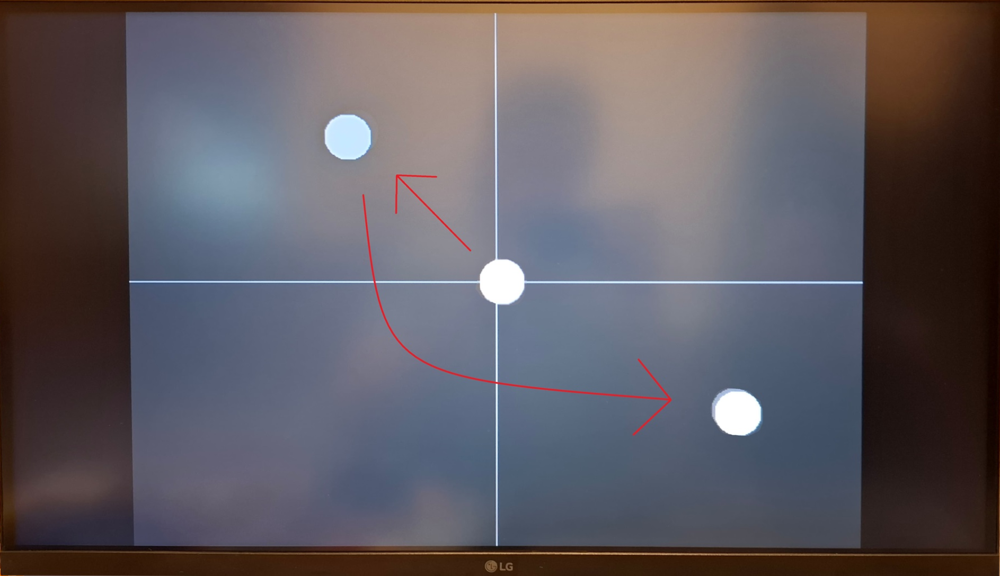

# FPGA_Demo_Projects

 
  

## Description
A small collection of Verilog projects developed for the [DE10-Lite FPGA development board](https://www.terasic.com.tw/cgi-bin/page/archive.pl?Language=English&CategoryNo=234&No=1021), produced by Intel. These were created for a third-year university project where we used an SPI driver to communicate with the ADXL345 accelerometer present on the board.

Two more projects were added that were made as part of my 2-week workshop at [FotoNation](https://www.fotonation.com/). These were meant to familiarize us with video processing and the HDMI interface on the [Zybo Z7 FPGA board](https://digilent.com/shop/zybo-z7-zynq-7000-arm-fpga-soc-development-board/?srsltid=AfmBOoqDfKOEMLqRJad5NjXkgbdCvC10xQusdVAV4oet77JfjSx9T61W).

## Projects
### 1. DE10L_basix_hex_movement
This was the first project, aimed at familiarizing the student with the Quartus environment and the FPGA board. It functions by moving a square, drawn across the six 7-segment displays, in a circular pattern. It introduces pin constraints on the board and basic Verilog syntax.

### 2. DE10L_basic_spi
In this project, we successfully communicated with the accelerometer sensor and retrieved the device ID from the first register of the IC. It uses a rudimentary SPI driver that translates the SPI interface into a request-acknowledge protocol, making it easier to use.

### 3. DE10L_spi_comm
A more advanced SPI project. I developed a robust, state-machine-based SPI driver that works at any clock speed and decouples the system from the SPI frequency. It translates the SPI interface into a FIFO-based input/output system and offers bulk read/write capabilities. This driver is used to retrieve the X and Y orientation in degrees from the accelerometer and map them to the 7-segment displays. A square moves around on the displays based on board inclination, similar to a digital spirit level.

### 4. DE10L_vga_display
A project designed to test the provided VGA driver and display accelerometer data. The `vga_driver` reads values from a separate module, `vga_feeder`, which handles various patterns and colors. It also receives orientation data and draws a circle on the screen that moves around, similar to a phone gyroscope app.

### 5. DE10L_final_project
The final project, designed to combine all the previous phases into one cohesive system.

### 6. HDMI_Project
First workshop Verilog project. It is designed to create a stream of video data fed into a pre-made HDMI driver. The project can display various flags and patterns, and also features a "rain mode," which shows a colorful rainfall-like effect made of randomly colored circles. These circles gradually fill the screen with layered colors.

 
  

### 7. HDMI_TextEditor
Second workshop Verilog project. This one emulates a text editor. I selected a monospace font image from the internet, translated it into a text file where each pixel is mapped to `'1'` for black and `'0'` for white, scaled each character to 32x32 pixels, and wrote the text values to a memory configuration file to make them accessible to the FPGA. Next, I created a TCL script to emulate a keyboard: it takes a string of characters and writes them to the screen.

 
  

## Other Photos
Phase 2: Device ID shown on the LEDs.

  

Simulation of the Phase 3 and 4 SPI driver.

  

Phase 4 result: The ball moves based on the tilt angle of the board.

